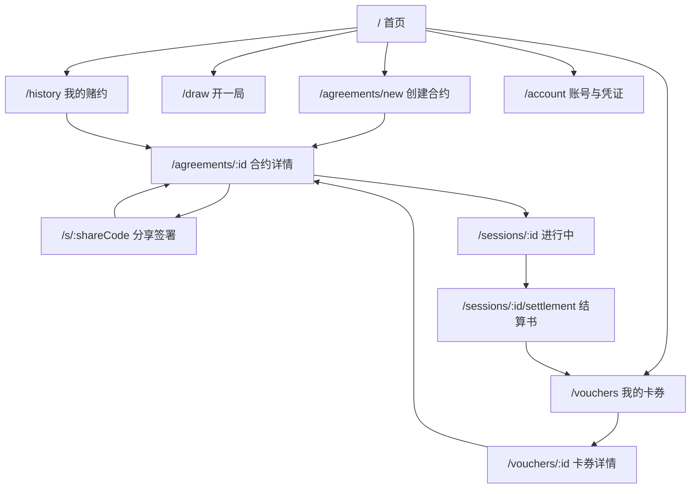

# Playbit 页面与路由关系草案

本草案用于约束 Web 版页面结构，后续迁移小程序时可映射为 page path。当前代码仍使用本地 screen state，等核心链路稳定后再迁到 `vue-router`。

## 核心原则

- 首页只保留两个主入口：立个赌约、开一局。
- 合约、签署、结算、卡券必须可通过链接独立打开。
- 登录只在需要保存、签署、核销、查看个人资产时触发。
- 分享页优先服务签约和结算传播，不做复杂关系空间。

## 建议路由

| 路由 | 页面 | 说明 |
| --- | --- | --- |
| `/` | 首页 | 两个主入口和轻账户入口 |
| `/agreements/new` | 创建合约 | 录入赌约、判定、赌注 |
| `/agreements/:id` | 合约详情 | 合同、双方签署状态、进入进行中 |
| `/s/:shareCode` | 分享签署 | 对方通过链接签约 |
| `/draw` | 抽卡开局 | 无现成赌约时抽一张现实挑战 |
| `/sessions/:id` | 进行中 | 当前挑战、参与者、结束并判定 |
| `/sessions/:id/settlement` | 结算书 | 胜负、赌注、履约/结案、分享 |
| `/vouchers` | 我的卡券 | 全部总览、待履约、待核销、已结案三类履约凭证 |
| `/vouchers/:id` | 卡券详情 | 关联合约、判定规则、核销记录 |
| `/history` | 我的赌约 | 历史合约列表 |
| `/account` | 账号与凭证 | 保存账号、登录、当前身份 |

## 页面职责

| 页面 | 主要对象 | 主操作 | 进入条件 |
| --- | --- | --- | --- |
| 首页 | 无 | 立个赌约 / 开一局 | 默认进入 |
| 创建合约 | BetSession 草稿 | 生成签约链接 | 不强制登录，自动临时身份 |
| 签署页 | ShareCode + BetSession | 确认签约 | 链接进入，必要时创建临时身份 |
| 合约详情 | BetSession + Contract | 分享 / 开始 / 查看状态 | 创建后、签署后、历史进入 |
| 进行中 | BetSession active | 结束并判定结果 | 双方签约后 |
| 结算书 | Settlement | 履约核销 / 分享 | 判定胜负后 |
| 我的卡券 | Coupon + BetSession | 去核销 / 查看合约 | 涉及个人履约凭证，需要身份 |
| 卡券详情 | Coupon | 核销 / 查看关联合约 | 从卡券页进入 |
| 历史 | BetSession 列表 | 查看合约 | 需要身份 |
| 账号 | User | 保存账号 / 登录 | 用户主动进入或跨设备找回时 |

## 状态与入口

| 状态 | 主要页面 | 卡券表现 |
| --- | --- | --- |
| `pending_confirmation` | 合约详情 / 签署页 | 暂不生成卡券 |
| `active` | 进行中 | 卡券页显示待履约合约 |
| `settling` | 结算书 | 卡券页显示待核销凭证 |
| `fulfilled` | 结算书 / 卡券页 | 卡券降饱和，进入已结案 |
| `finished` | 历史 | 只保留归档记录 |

## MVP 导航关系

## 卡券页承担的视觉母版

卡券页先沉淀移动端专业视觉标准：浅灰页面背景、单层状态导航、全部总览分组、低饱和票据、稳定字号层级、状态可视化、主操作按钮、规则/合约二级入口。卡券只表示单一履约凭证，不用数量聚合；每个状态默认展示 3 张，更多通过展开继续显示。合约页和结算页后续应继承这套 token，而不是重新生成另一套视觉语言。
