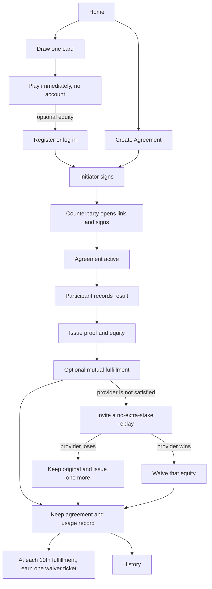

# Page And Route Map

The web app currently uses a local screen state rather than `vue-router`. These
paths describe the intended page boundary and can later map to mini-program
pages without changing the domain model.

## Page Map

| Path | Page | Identity |
| --- | --- | --- |
| `/` | Home: 立合约 / 开一局, plus history and equity shortcuts | Optional |
| `/agreements/new` | Create an existing-life agreement and choose equity | Required at submit |
| `/agreements/:id` | Agreement document, signatures, current state | Participant only |
| `/s/:shareCode` | Read pending agreement and sign as counterparty | Read public; sign requires account |
| `/draw` | Draw a curated card and play immediately | Not required |
| `/agreements/:id/play` | Active signed agreement, boosts, participant result record | Participant only |
| `/agreements/:id/proof` | User-issued agreement, result, fulfillment, or waiver certificate | Participant only |
| `/flips/:id` | Shared replay invitation, card, and participant-submitted outcome | Flip participants |
| `/vouchers` | Pending fulfillment, available/used equity, and earned waiver tickets | Required |
| `/vouchers/:id` | Equity details, linked agreement, replay, waiver, and redemption actions | Holder/provider |
| `/history` | Personal Agreement archive | Required |
| `/account` | Account and saved signature | Required |

The Draw page owns only the in-memory card currently being played. It does not
create an Agreement. Choosing **加点权益** opens the existing equity/signature
flow; authentication is requested there and must leave the selected card,
stake choice, and signature draft intact.

## Agreement State

| State | Meaning | Equity behavior |
| --- | --- | --- |
| `pending_signature` | Initiator signed; waiting for counterparty | No coupon |
| `active` | Both participants signed | In-play boosts may be proposed |
| `result_recorded` | A participant recorded the agreed result | Coupon is issued to holder; provider may fulfill it |
| `fulfilled` | Holder and provider completed redemption | Agreement and coupon remain in history |
| `waived` | Participants confirmed a waiver for the original equity | Agreement and waiver decision remain in history |

Result submission records the submitting participant. Playbit does not judge
the event or enforce fulfillment. A play-again action is a new game entry, not
an appeal or mutation of the old result.

## Flip And Waiver

- A flip starts from an available equity awaiting fulfillment. The provider
  invites the holder; accepting starts a card game without choosing or adding
  another stake.
- If the provider is recorded as the winner, that coupon is waived. If the
  provider loses, the original coupon remains and one new coupon with the same
  terms is issued. Each coupon keeps its own identity under the same Agreement.
- A 赖皮券 is issued for every 10-fulfillment milestone. Its holder may request
  waiver of one available equity; the equity holder confirms or declines.
  Declining restores both the coupon and ticket. Confirming waives only that
  coupon and retains the Agreement and request history.
- A proof image is derived from the current Agreement or Flip record and is
  created only when a participant chooses to issue or share it.

## API Boundary

| API | Purpose | Identity |
| --- | --- | --- |
| `POST /cards/draw` | Draw one public card | None |
| `POST /agreements`, `GET /agreements` | Create/list personal agreements | Account |
| `GET /agreements/:id`, `GET /agreements/:id/events` | Read and synchronize an agreement | Participant |
| `GET /share/:shareCode` | Read a pending shared agreement | Public while pending |
| `POST /share/:shareCode/sign` | Sign as invited counterparty | Account, non-initiator |
| `PATCH /agreements/:id/result` | Record a participant-selected result | Participant |
| `POST /agreements/:id/fulfill` | Record fulfillment of point/custom equity | Participant |
| `POST /agreements/:id/boost` and `/boost/:id/confirm` | Amend the existing equity | Participant; both confirm |
| `GET /coupons`, `PATCH /coupons/:id/use` | Read or redeem equity | Account; holder redeems |
| `POST /agreements/:id/flips`, `/flips/:id/*` | Invite, accept/decline, and record a replay | Agreement/Flip participants |
| `GET /grace`, `POST /grace/:ticketId/waivers`, `PATCH /grace/waivers/:id` | Earn and mutually apply waiver tickets | Account; provider requests, holder responds |

